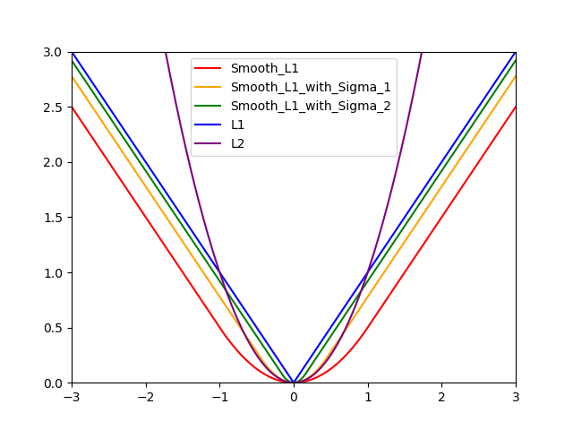

# Loss Difference (Python)

## # Difference
- Smooth L1 Loss
- Smooth L1 Loss (with sigma)
- L1 Loss
- L2 Loss

## # Summary
- The closer the sigma of Smooth L1 Loss is to 3.0, the same as L1

## # Graph


## # Code
```python
def L1_Loss(x):
    return np.abs(x)

def L2_Loss(x):
    return (x ** 2)

def Smooth_L1_Loss(x):
    x = np.abs(x)
    smooth_l1_loss = np.where(x < 1.0, 0.5 * (x ** 2), x - 0.5)

    return smooth_l1_loss

def Smooth_L1_Loss_with_Sigma(x, sigma = 1.5):
    sigma2 = sigma * sigma
    x = np.abs(x)
    smooth_l1_loss = np.where(x < (1.0 / sigma2), sigma2 * 0.5 * (x ** 2), x - 0.5 / sigma2)
    
    return smooth_l1_loss
```

## # Reference
- matplotlib
- numpy